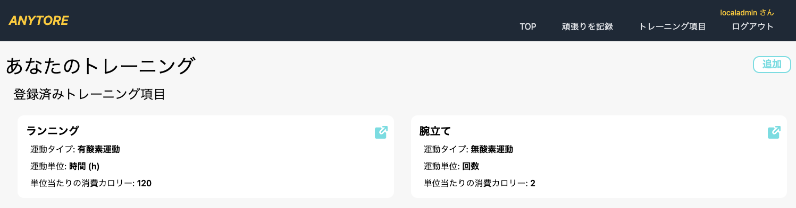
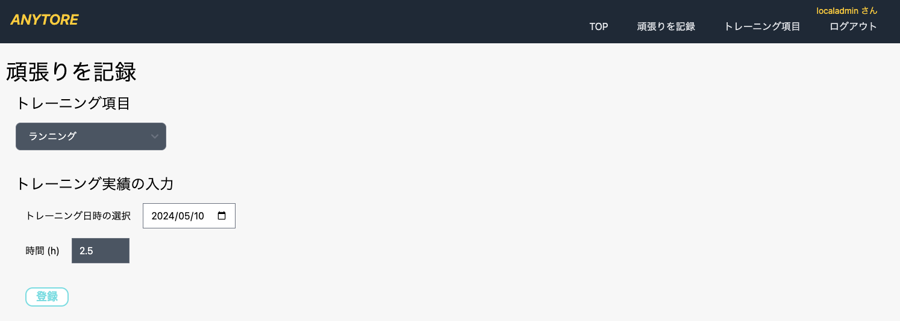
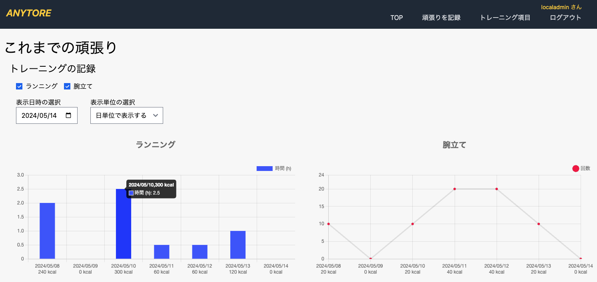

<p align="center">
  
</p>

# Anytore (Frontend)

## Introduction to Anytore

Anytore is a simple web application for recording your daily training. The frontend is in this repository, and the backend can be found at the following repository: [https://github.com/openkrafter/anytore-backend](https://github.com/openkrafter/anytore-backend)

## Application Screenshots

1. **Training Items Screen**
   

2. **Record Your Effort Screen**
   

3. **View Your Records Screen**
   

## Usage

You can deploy it to a local environment using Docker or set it up on AWS.

### Local Deployment Steps

> **Note:** The following steps require Docker, Docker Compose, and AWS CLI to be installed.

1. **Backend Application Local Setup**

   - Refer to the [backend application repository](https://github.com/openkrafter/anytore-backend).

2. **Frontend Application Local Setup**

   - Clone the repository.

     ```sh
     git clone https://github.com/openkrafter/anytore.git
     ```

   - Configure AWS CLI settings.

     ```sh
     aws configure set aws_access_key_id dummy
     aws configure set aws_secret_access_key dummy
     aws configure set region ap-northeast-1
     ```

     > **Note:** The values can be arbitrary. If AWS credentials are already set up, reconfiguration is not necessary.

   - Run the local environment setup script.

     ```sh
     cd anytore
     platform/local/local-setup.sh
     ```

## Testing

1. Open your browser and access to `http://localhost:8081/login`.
2. On the login screen, enter the following initial user credentials:
   - **Email:** localadmin@example.com
   - **Password:** localpass
3. Register training content from "Training Items" and record daily training from "Record Your Effort."

### Additional Information

- User management can be done from the admin screen (`http://localhost:8081/`).
  - Only users with the username "localadmin" can manage users.
  - Other users can access the admin screen but not view and edit user information.

## Cleanup

To delete Anytore (Frontend), run the following script:

```sh
platform/local/local-teardown.sh
```

## Tech Stack

- macOS / Linux
- Docker
- Vue.js
- Nginx
